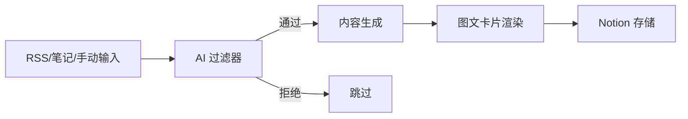
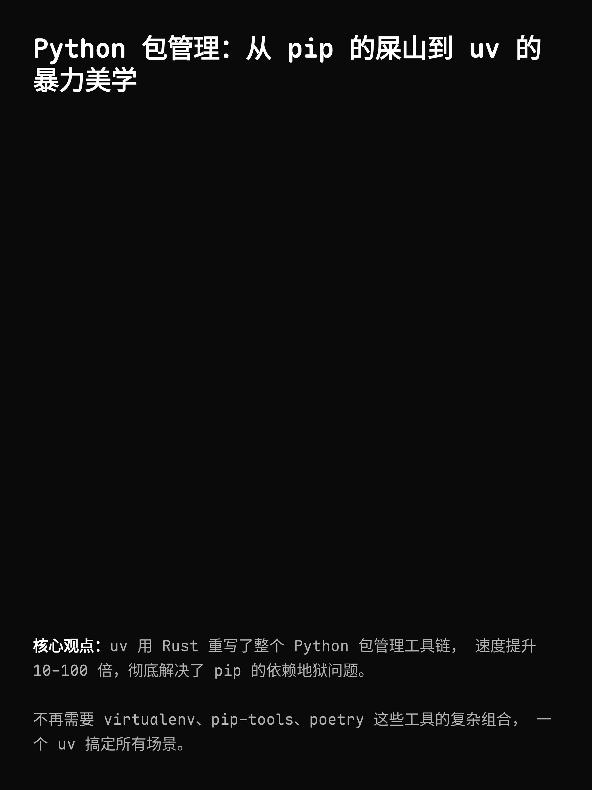
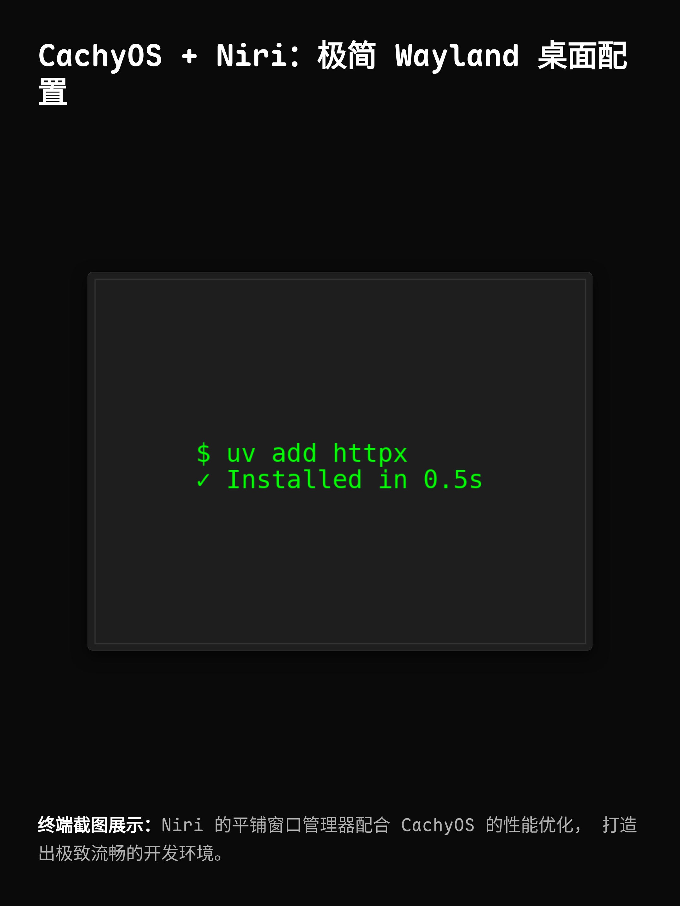

<div align="center">

# 🎯 Matrix

**全自动内容降维打击流水线 | AI-Powered Content Pipeline**

[](https://www.python.org/downloads/)
[](LICENSE)
[](https://github.com/astral-sh/ruff)
[](CONTRIBUTING.md)
[](https://github.com/iridite/matrix/stargazers)
[](https://github.com/iridite/matrix/network/members)

[English](README.md) | [简体中文](README_CN.md)

**取代臃肿的 n8n，用纯 Python 实现极简、高效、可控的 AI 内容处理管道**

[快速开始](#-快速开始) • [功能特性](#-功能特性) • [架构设计](#-架构设计) • [文档](#-文档) • [社区](#-社区)

</div>

---

## 📖 目录

- [✨ 功能特性](#-功能特性)
- [🎬 演示](#-演示)
- [🚀 快速开始](#-快速开始)
- [🏗️ 架构设计](#️-架构设计)
- [🔧 工作流模式](#-工作流模式)
- [📦 核心模块](#-核心模块)
- [🎨 图文卡片渲染](#-图文卡片渲染)
- [🔌 多源输入系统](#-多源输入系统)
- [⚙️ 配置说明](#️-配置说明)
- [🧪 测试](#-测试)
- [📚 文档](#-文档)
- [🤝 贡献指南](#-贡献指南)
- [💬 社区](#-社区)
- [📄 许可证](#-许可证)
- [🙏 致谢](#-致谢)

---

## ✨ 功能特性

### 🎯 核心能力

- **🤖 多模式 AI 协作**：支持单 AI、Multi-Agent、LangGraph 自主迭代等 4 种工作流
- **🔄 智能内容过滤**：AI 预处理网关，自动筛选高价值内容
- **✍️ 风格化改写**：Iridite 风格（极简、疲惫感、冷酷建议）
- **🎨 图文卡片生成**：自动渲染极客风格的 3:4 视觉卡片（1080x1440）
- **📊 Notion 集成**：无缝写入 Notion Database，支持历史查询和去重
- **🔌 多源输入**：支持 RSS、本地笔记、手动输入等多种内容来源

### 💪 技术优势

- **极简架构**：拒绝过度设计，函数式管道，零 Class 继承树
- **绝对容错**：单篇失败不崩溃，Ctrl+C 瞬间中断
- **高性能**：基于 `uv` 包管理器，依赖安装速度提升 10-100x
- **类型安全**：Pydantic 严格校验，杜绝运行时类型错误
- **可观测性**：极简日志输出，一目了然的执行状态

---

## 🎬 演示

### 工作流可视化



### 输出示例

<table>
<tr>
<td width="50%">

**纯文字卡片**


</td>
<td width="50%">

**图文卡片**


</td>
</tr>
</table>

---

## 🚀 快速开始

### 前置要求

- Python 3.11+
- [uv](https://github.com/astral-sh/uv) 包管理器
- Anthropic API Key（Claude）
- Notion API Token（可选）

### 安装

```bash
# 1. 克隆仓库
git clone https://github.com/iridite/matrix.git
cd matrix

# 2. 使用 uv 安装依赖
uv venv
source .venv/bin/activate  # Linux/Mac
# .venv\Scripts\activate   # Windows

uv pip install -e .

# 3. 安装 Playwright 浏览器（用于图文卡片渲染）
uv run playwright install chromium
```

### 配置

```bash
# 复制环境变量模板
cp .env.example .env

# 编辑 .env 填入你的 API Keys
nano .env
```

**必需配置：**
```env
ANTHROPIC_API_KEY=sk-ant-xxx
```

**可选配置：**
```env
NOTION_API_TOKEN=ntn_xxx
NOTION_DATABASE_ID=xxx
```

### 运行

```bash
# 使用默认配置运行（单 AI 模式）
uv run python -m matrix.main

# 或使用 LangGraph 自主迭代模式
# 编辑 src/matrix/config.py，设置 AGENT_MODE = "langgraph"
uv run python -m matrix.main
```

---

## 🏗️ 架构设计

### 设计理念

Matrix 遵循三大核心原则：

1. **极小执行力**：每行代码都有明确价值，拒绝过度抽象
2. **绝对容错**：单点故障不影响整体流程
3. **高租售比**：用最少的代码实现最大的价值

### 项目结构

```
matrix/
├── src/matrix/           # 核心包
│   ├── agents/          # Multi-Agent 协作系统
│   ├── core/            # 核心模块（fetcher/sniper/writer）
│   ├── graph/           # LangGraph 状态机
│   ├── renderers/       # 图文卡片渲染器
│   ├── sinks/           # 输出模块（Notion）
│   ├── tools/           # 工具集（Notion API）
│   ├── config.py        # 配置文件
│   └── main.py          # 主入口
├── prompts/             # AI Prompt 模板
├── docs/                # 文档
├── tests/               # 测试套件
└── scripts/             # 辅助脚本
```

---

## 🔧 工作流模式

Matrix 支持 **4 种内容生成模式**，在 `src/matrix/config.py` 中配置：

### 模式 1: 单 AI 模式（默认）⚡

```python
AGENT_MODE = False
```

**流程：**
```
RSS → AI 过滤 → AI 改写 → Notion
```

**特点：**
- ⚡ 最快最便宜（1 次 API 调用）
- 📊 适合快速批量生成
- 🎯 质量稳定但缺乏多样性

---

### 模式 2: 基础 Multi-Agent 🤝

```python
AGENT_MODE = "basic"
```

**流程：**
```
RSS → AI 过滤 → 3 Writers (并行) → Critic → Editor → Notion
```

**特点：**
- 🎭 多样性好，综合多个视角
- 🔄 固定流程（5 次 API 调用）
- ❌ 无迭代优化

---

### 模式 3: LangGraph Agent（自主迭代）🧠

```python
AGENT_MODE = "langgraph"
```

**流程：**
```
RSS → AI 过滤 → Research → Writer ⇄ Critic (迭代) → Editor → Notion
```

**特点：**
- 🔄 **自主迭代**：Critic 自动判断质量，不满意则触发重写
- 📈 **动态流程**：4-8 次 API 调用（根据质量动态调整）
- 🎯 **市场导��**：Research Agent 分析热点和受众需求
- ✨ **质量优先**：持续优化直到满意（最多 3 次迭代）

---

### 模式 4: 增强版 LangGraph（Notion 工具集成）⭐ 推荐

```python
AGENT_MODE = "langgraph_enhanced"
```

**流程：**
```
RSS → AI 过滤 → Research (+ Notion 查询) → Writer ⇄ Critic → Editor → Notion
```

**特点：**
- ✅ **Notion 集成**：Agent 可查询历史文章，避免重复
- 🧠 **上下文感知**：了解最近发布的主题，保持内容多样性
- 🎯 **智能决策**：基于历史数据调整写作角度
- 🔄 **自主迭代**：继承 LangGraph 的所有优势
- 📊 **API 调用**：5-10 次（包含 Notion 查询）

---

## 📦 核心模块

### 🎣 Fetcher - RSS 抓取器

```python
from matrix.core.fetcher import fetch_feeds

articles = fetch_feeds(
    feeds=["https://hnrss.org/frontpage"],
    max_items_per_feed=5
)
```

**特性：**
- 支持 RSS/Atom 格式
- 物理截断防止 API 暴走
- 标准化输出格式

---

### 🎯 Sniper - AI 预处理网关

```python
from matrix.core.sniper import filter_article

result = filter_article(article)
# FilterResult(pass_filter=True, category="技术", reason="...", suggested_angle="...")
```

**特性：**
- 模型：Claude Sonnet 4.5
- Pydantic 严格校验
- 智能分类和角度建议

---

### ✍️ Writer - 内容生成器

```python
from matrix.core.writer import generate_article

output = generate_article(article, suggested_angle)
# ArticleOutput(title="...", content="...", seo_tags=[...])
```

**特性：**
- 模型：Claude Sonnet 4.5
- Iridite 风格（极简、疲惫感、冷酷建议）
- 自动生成 SEO 标签

---

### 💾 Notion Sink - 存储器

```python
from matrix.sinks.notion_sink import save_to_notion

save_to_notion(output_dict, database_id)
```

**特性：**
- 支持长文本分块（2000 字符/段）
- 自动处理 Markdown 格式
- 错误重试机制

---

## 🎨 图文卡片渲染

Matrix 支持生成极客风格的 3:4 视觉卡片（1080x1440），适合社交媒体分享。

### 使用方法

```python
from matrix.renderers.image_renderer import generate_card

# 纯文字卡片
generate_card(
    title="标题",
    content="内容",
    output_path="output.png"
)

# 图文卡片（1-2 张图片）
generate_card(
    title="标题",
    content="内容",
    image_paths=["screenshot1.png", "screenshot2.png"],
    output_path="output.png"
)
```

### 设计特点

- 🎨 深色极客风格（#0A0A0A 背景）
- 📐 3:4 比例（1080x1440）
- 🖼️ 支持 0-2 张图片动态布局
- 🎯 Retina 渲染（2x DPI）
- ⚡ Playwright 高性能渲染

---

## 🔌 多源输入系统

除了 RSS，Matrix 还支持多种内容来源：

### 1. RSS 源

```python
from matrix.sources.rss_source import RSSSource

source = RSSSource(feeds=["https://example.com/feed"])
articles = source.fetch()
```

### 2. 本地笔记

```python
from matrix.sources.note_source import NoteSource

source = NoteSource(notes_dir="~/notes")
articles = source.fetch()
```

### 3. 手动输入

```python
from matrix.sources.manual_source import ManualSource

source = ManualSource()
articles = source.fetch()  # 交互式输入
```

---

## ⚙️ 配置说明

### 环境变量

| 变量名 | 必需 | 说明 |
|--------|------|------|
| `ANTHROPIC_API_KEY` | ✅ | Claude API Key |
| `ANTHROPIC_BASE_URL` | ❌ | Third-party API endpoint (leave empty for official API) |
| `NOTION_API_TOKEN` | ❌ | Notion Integration Token |
| `NOTION_DATABASE_ID` | ❌ | Notion Database ID |

**Third-party API Support**: Matrix supports Anthropic-compatible third-party services. See [Third-party API Guide](docs/third-party-api.md) for details.

### 工作流配置

编辑 `src/matrix/config.py`：

```python
# 选择工作流模式
AGENT_MODE = False              # 单 AI（快速）
AGENT_MODE = "basic"            # 基础 Multi-Agent（多样性）
AGENT_MODE = "langgraph"        # LangGraph（自主迭代）
AGENT_MODE = "langgraph_enhanced"  # 增强版（推荐）
```

---

## 🧪 测试

```bash
# 运行所有测试
uv run pytest tests/

# 测试图文卡片渲染
uv run python tests/test_image_renderer.py

# 测试 LangGraph 工作流
uv run python tests/test_langgraph.py

# 测试 Notion 工具
uv run python tests/test_notion_tools.py
```

---

## 📚 文档

- [架构设计](ARCHITECTURE.md) - 系统设计哲学
- [AI 框架分析](docs/ai-frameworks-analysis.md) - 为什么选择原生实现
- [LangGraph 探索](docs/langgraph-exploration.md) - 自主 Agent 系统设计
- [LangGraph 严格架构](docs/langgraph-strict-architecture.md) - 状态机实现细节
- [Notion 工具指南](docs/notion-tools-guide.md) - Notion API 集成
- [图文卡片指南](docs/image-renderer-guide.md) - 卡片渲染器使用

---

## 🤝 贡献指南

我们欢迎所有形式的贡献！

### 如何贡献

1. Fork 本仓库
2. 创建特性分支 (`git checkout -b feature/AmazingFeature`)
3. 提交更改 (`git commit -m 'Add some AmazingFeature'`)
4. 推送到分支 (`git push origin feature/AmazingFeature`)
5. 开启 Pull Request

### 代码规范

- 使用 [Ruff](https://github.com/astral-sh/ruff) 进行代码格式化和 lint
- 遵循 PEP 8 风格指南
- 添加必要的类型注解
- 编写清晰的 commit message

---

## 💬 社区

### 加入我们

<table>
<tr>
<td align="center" width="50%">

**微信交流群**


扫码添加微信，备注「Matrix」

</td>
<td align="center" width="50%">

**Discord 社区**

[](https://discord.gg/YOUR_INVITE_CODE)

[点击加入 Discord](https://discord.gg/YOUR_INVITE_CODE)

</td>
</tr>
</table>

### 关注我们

- 🐦 Twitter: [@iridite_dev](https://twitter.com/iridite_dev)
- 📝 博客: [blog.iridite.dev](https://blog.iridite.dev)
- 📧 邮件: [hello@iridite.dev](mailto:hello@iridite.dev)

---

## 📊 项目统计


---

## 🗺️ Roadmap

- [ ] 支持更多 AI 模型（OpenAI GPT-4、Google Gemini）
- [ ] Web UI 管理界面
- [ ] 定时任务调度
- [ ] 内容质量评分系统
- [ ] 多语言支持（英文、日文）
- [ ] Docker 容器化部署
- [ ] 云端部署方案（AWS Lambda、Vercel）

---

## 📄 许可证

本项目采用 [MIT License](LICENSE) 开源协议。

---

## 🙏 致谢

### 核心依赖

- [Anthropic Claude](https://www.anthropic.com/) - 强大的 AI 模型
- [LangGraph](https://github.com/langchain-ai/langgraph) - Agent 工作流编排
- [uv](https://github.com/astral-sh/uv) - 极速 Python 包管理器
- [Playwright](https://playwright.dev/) - 浏览器自动化
- [Pydantic](https://pydantic.dev/) - 数据验证

### 灵感来源

- [n8n](https://n8n.io/) - 工作流自动化平台
- [AutoGPT](https://github.com/Significant-Gravitas/AutoGPT) - 自主 AI Agent
- [LangChain](https://github.com/langchain-ai/langchain) - LLM 应用框架

---

## ⭐ Star History

[](https://star-history.com/#iridite/matrix&Date)

---

<div align="center">

**如果这个项目对你有帮助，请给我们一个 ⭐ Star！**

Made with ❤️ by [Iridite](https://github.com/iridite)

[⬆ 回到顶部](#-matrix)

</div>
