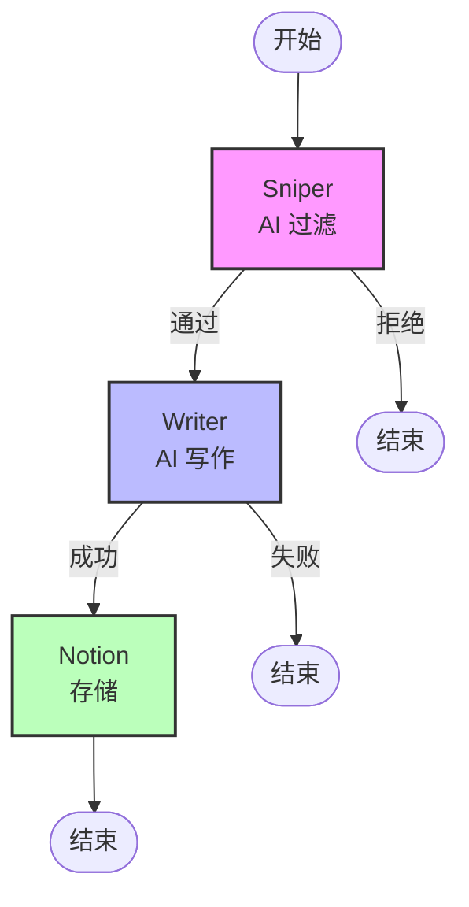

# LangGraph 状态机重构

## 概述

将 Matrix 流水线重构为标准的 LangGraph 状态机工作流，实现：
- ✅ 清晰的状态管理
- ✅ 条件路由决策
- ✅ 可视化工作流
- ✅ 更好的错误处理

## 架构对比

### 原始架构（线性流程）
```python
# main.py
for article in articles:
    result = filter_article(article)
    if result.pass_filter:
        output = generate_article(article)
        save_to_notion(output)
```

**问题：**
- 状态分散在各个变量中
- 流程控制逻辑混杂
- 难以可视化和调试

### LangGraph 架构（状态机）
```python
# graph_builder.py
class ArticleState(TypedDict):
    title: str
    pass_filter: bool
    draft_content: Optional[str]
    # ... 所有状态集中管理

workflow = StateGraph(ArticleState)
workflow.add_node("sniper", sniper_node)
workflow.add_node("writer", writer_node)
workflow.add_conditional_edges("sniper", should_write)
```

**优势：**
- ✅ 状态集中管理
- ✅ 流程清晰可见
- ✅ 易于扩展和维护

## 工作流图



## 核心组件

### 1. ArticleState (状态定义)

```python
class ArticleState(TypedDict):
    # 原始数据
    title: str
    link: str
    summary: str
    published_date: str

    # Sniper 处理结果
    pass_filter: bool
    category: Optional[str]
    reason: Optional[str]
    suggested_angle: Optional[str]

    # Writer 处理结果
    draft_title: Optional[str]
    draft_content: Optional[str]
    seo_tags: Optional[list[str]]

    # Notion 处理结果
    notion_url: Optional[str]
    error: Optional[str]
```

**设计原则：**
- 所有状态集中在一个 TypedDict 中
- 使用 Optional 标记可能为空的字段
- 状态按处理阶段分组

### 2. 节点 (Nodes)

#### Sniper Node
```python
def sniper_node(self, state: ArticleState) -> ArticleState:
    """过滤节点 - AI 判断是否值得改写"""
    result = filter_article(article)
    return {
        **state,
        "pass_filter": result.pass_filter,
        "category": result.category,
        "reason": result.reason,
        "suggested_angle": result.suggested_angle
    }
```

#### Writer Node
```python
def writer_node(self, state: ArticleState) -> ArticleState:
    """写作节点 - AI 生成内容"""
    output = generate_article(article, state["suggested_angle"])
    return {
        **state,
        "draft_title": output.title,
        "draft_content": output.content,
        "seo_tags": output.seo_tags
    }
```

#### Notion Node
```python
def notion_node(self, state: ArticleState) -> ArticleState:
    """存储节点 - 写入 Notion"""
    success = save_to_notion(article_output, self.notion_db_id)
    return {
        **state,
        "notion_url": "已保存" if success else None
    }
```

### 3. 条件边 (Conditional Edges)

#### should_write
```python
def should_write(self, state: ArticleState) -> Literal["writer", "end"]:
    """决策函数 - 是否进入写作节点"""
    if state.get("pass_filter"):
        return "writer"
    else:
        return "end"
```

#### should_save
```python
def should_save(self, state: ArticleState) -> Literal["notion", "end"]:
    """决策函数 - 是否保存到 Notion"""
    if state.get("error"):
        return "end"
    elif state.get("draft_content"):
        return "notion"
    else:
        return "end"
```

## 使用方法

### 1. 单篇文章处理

```python
from graph_builder import process_article

article = {
    "title": "AI 最新突破",
    "link": "https://example.com",
    "summary": "...",
    "published_date": "2026-03-03"
}

result = process_article(article, notion_db_id)

# 检查结果
if result["notion_url"]:
    print(f"✅ 成功: {result['draft_title']}")
elif result["error"]:
    print(f"❌ 失败: {result['error']}")
else:
    print(f"⏭️  跳过: {result['reason']}")
```

### 2. 批量处理

```python
from graph_builder import process_articles_batch

rss_feeds = [
    "https://hnrss.org/frontpage",
    "https://www.reddit.com/r/programming/.rss"
]

process_articles_batch(rss_feeds, max_items=5, notion_db_id=db_id)
```

### 3. 使用新的 main 文件

```bash
python main_graph.py
```

## 可视化工具

```bash
python visualize_graph.py
```

输出：
- 节点列表
- 边的连接关系
- 状态字段说明
- 工作流程示例
- Mermaid 流程图代码

## 状态流转示例

### 场景 1: 正常流程

```
初始状态:
{
    "title": "AI 最新突破",
    "link": "https://...",
    "pass_filter": False,
    "draft_content": None,
    "notion_url": None
}

↓ sniper_node

{
    "title": "AI 最新突破",
    "pass_filter": True,
    "category": "技术",
    "suggested_angle": "从产品化角度分析"
}

↓ writer_node

{
    "draft_title": "AI 产品化的三大挑战",
    "draft_content": "# 内容...",
    "seo_tags": ["AI", "产品化"]
}

↓ notion_node

{
    "notion_url": "已保存"
}
```

### 场景 2: 过滤失败

```
初始状态 → sniper_node → END

{
    "pass_filter": False,
    "reason": "内容质量不足"
}
```

### 场景 3: 写作失败

```
初始状态 → sniper_node → writer_node → END

{
    "pass_filter": True,
    "error": "Writer 失败: API timeout"
}
```

## 扩展性

### 添加新节点

```python
def translator_node(self, state: ArticleState) -> ArticleState:
    """翻译节点 - 翻译成多语言"""
    # 实现翻译逻辑
    return {
        **state,
        "translated_content": translated_text
    }

# 在 build_graph 中添加
workflow.add_node("translator", self.translator_node)
workflow.add_edge("writer", "translator")
workflow.add_edge("translator", "notion")
```

### 添加并行节点

```python
# 同时生成多个版本
workflow.add_node("writer_v1", self.writer_node_v1)
workflow.add_node("writer_v2", self.writer_node_v2)

# 并行执行
workflow.add_edge("sniper", "writer_v1")
workflow.add_edge("sniper", "writer_v2")
```

### 添加循环

```python
def should_retry(self, state: ArticleState) -> Literal["writer", "notion"]:
    """决策函数 - 是否重试"""
    if state.get("retry_count", 0) < 3:
        return "writer"
    else:
        return "notion"

workflow.add_conditional_edges("writer", should_retry)
```

## 对比原有 Agent 系统

| 特性 | 原始 main.py | LangGraph 状态机 |
|------|-------------|-----------------|
| 状态管理 | 分散在变量中 | 集中在 State 中 |
| 流程控制 | if-else 嵌套 | 条件边路由 |
| 可视化 | 无 | Mermaid 图 |
| 扩展性 | 需修改主逻辑 | 添加节点即可 |
| 调试 | 难以追踪状态 | 每步状态清晰 |
| 错误处理 | try-except | 状态中的 error 字段 |

## 与 Multi-Agent 模式的关系

LangGraph 状态机是**基础架构**，可以与 Multi-Agent 模式结合：

```python
# 在 writer_node 中调用 Multi-Agent
def writer_node(self, state: ArticleState) -> ArticleState:
    if AGENT_MODE == "langgraph_enhanced":
        output = collaborative_generate_enhanced(article_data)
    else:
        output = generate_article(article, angle)

    return {**state, "draft_content": output["content"]}
```

## 最佳实践

1. **状态不可变**
   - 每个节点返回新的状态，不修改原状态
   - 使用 `{**state, "new_field": value}` 模式

2. **错误处理**
   - 在状态中添加 `error` 字段
   - 条件边检查 `error` 决定路由

3. **日志记录**
   - 每个节点打印当前操作
   - 使用 emoji 标识不同阶段

4. **类型安全**
   - 使用 TypedDict 定义状态
   - 使用 Literal 定义路由选项

## 下一步

- [ ] 添加重试机制
- [ ] 添加并行处理多篇文章
- [ ] 集成 Multi-Agent 模式
- [ ] 添加状态持久化
- [ ] 添加性能监控

---

*创建时间：2026-03-03*
